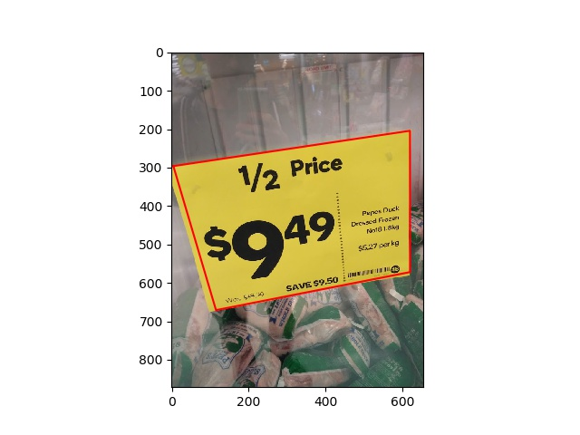

Image Warpping using Homography Transformation

- Step 1: Manually pick 4 points of **one rectangle** in the **same plane** in original image
- Step 2: Compute homography matrix H
- Step 3: Compute transformed image using H

<!-- | Input       | Output       |
| ----------- | ------------ |
|  |  | -->

- Input - Image  and selected rectangle (red rectangle)
  

- Output
  

